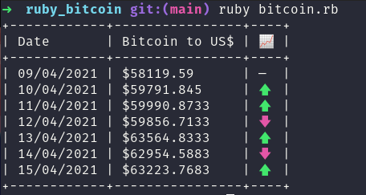
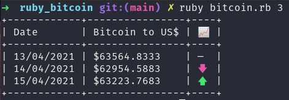

# ruby_bitcoin

## Description
📜 Simple Ruby script to get bitcoin prices from the last few days. This short app was developed following a [Ruby challenge](https://youtu.be/BwQOqwueVDA) by [OneBitCode](https://www.youtube.com/channel/UC44Mzz2-5TpyfklUCQ5NuxQ).

## How to run
💻 In order to run the project on your machine, you'll need to have [Ruby]()(you can follow [it's documentation]()) installed in your machine. After that you can `gem install bundler` in case you haven't installed bundler yet. With that out of the way, you can clone the repository to your machine, get in the project's folder and run:
```
bundle install
```
to install the gems needed for the app. Now we can get to the fun part and actually get our bitcoin prices. You can run the script with no parameters to get the prices for the last seven days:
```
ruby bitcoin.rb
```

And you can also run it with the amount of `past_days` you want to get, like:
```
ruby bitcoin.rb <past_days>
```
For example:
```
ruby bitcoin.rb 3
```

## In action
The two commands, with and without the parameter, will get you the following results:



As you can see, once called, the script will print out a table with three columns:
- The date from which we get de bitcoin price
- Bitcoin price for that day
- Variation compared to the previous day (the first row will always be empty since there isn't a previous day to compare to)

## Interesting Links
[Emoji pattern for commit messages](https://gitmoji.dev/)


